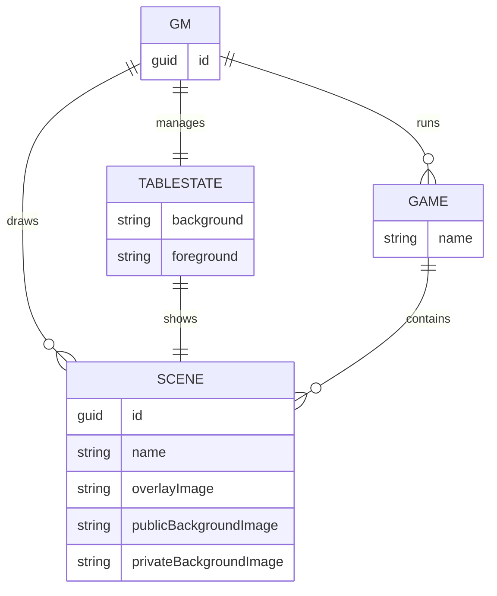

Node.js implementation of network table top server.

* accepts resources from the editing client
* notifies the tabletop client of updates

# Technologies

* Node.js for the base server
* Express for request handling
* Multer for image upload
* ws for websocket communication (status updates to the tabletop client)

# Disabling Authentication

For the server, run with the `DISABLE_AUTH` environment variable set to `true`.
This will:

1. Stop the server from checking the `Authorization` header.
1. Signal to the client through the `/noauth` endpoint that authentication is
not required.

# Future Work

* S3/R2 storage (get rid of persistant volume)
* Stateful game (multiple maps and overlays saved)
* DM content vs Table content (eg: DM versions of images with annotations)
* Notes
  * To track NPCs, prior events, etc and tie them to a place
* Beyond Integration?

# Testing

```
curl -v -X PUT http://localhost:3000/asset -F "layer=background" -F "image=@image.png"
curl -v -X PUT http://localhost:3000/asset -F "layer=background" -F "image=https://media.dndbeyond.com/compendium-images/lmop/M14LHJMMQhUuZ46S/map-1.1-Cragmaw-Hideout-player.jpg"
curl -v -X PUT http://localhost:3000/state
curl -v -X PUT http://localhost:3000/viewport -H 'Content-Type: application/json' -d '{"x":0,"y": 0, "width": 1, "height": 1}'
```

Where image is actually located at ./image.png

# Data Model

This data model only applies when there is a database. In standalone (eg: basic docker) there is only a single tablestate shared across all connections.



## File Layout

Follow a pathing structure like `/ENVIRONMENT/USER/GAME/SCENE` then quota enforement should be easyier as we can just roll up. S3 offers free storage for a year so maybe see if we can work that out!

Looks like presigned URLs might be what we need...