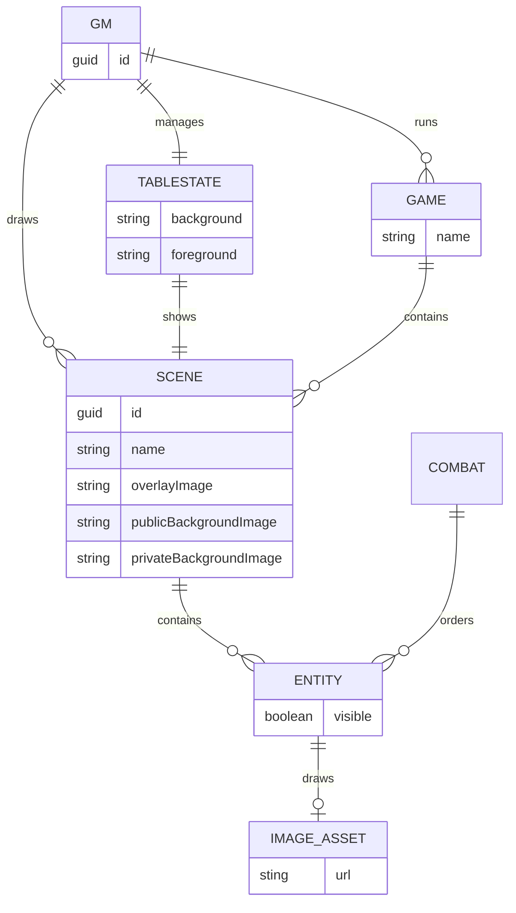

Node.js implementation of network table top server.

* accepts resources from the editing client
* notifies the tabletop client of updates

# Technologies

* Node.js for the base server
* Express for request handling
* Presigned S3 URLs for image upload (uploads go directly to object storage)
* ws for websocket communication (status updates to the tabletop client)

# Disabling Authentication

For the server, run with the `DISABLE_AUTH` environment variable set to `true`.
This will:

1. Stop the server from checking the `Authorization` header.
1. Signal to the client through the `/noauth` endpoint that authentication is
not required.

# Storage

Assets are stored in S3 (or an S3-compatible service such as R2 or MinIO).
Configure:

```
STORAGE_S3_BUCKET=<bucket>
STORAGE_S3_REGION=<region>
STORAGE_S3_ACCESS_KEY_ID=<access-key>
STORAGE_S3_SECRET_ACCESS_KEY=<secret-key>
```

Optional:

```
STORAGE_S3_ENDPOINT=<custom-endpoint>
STORAGE_S3_FORCE_PATH_STYLE=true
```

Note that `STORAGE_S3_ENDPOINT` does not include a protocol (`https://` is assumed).

## Upload flow

Image bytes never pass through the API:

1. `POST /asset/:id/data` with `{"contentType": "image/png"}` returns a
   short-lived presigned PUT URL and the target location.
2. The client PUTs the file directly to object storage using that URL,
   sending the same `Content-Type` header (it is part of the signature).
3. `PUT /asset/:id/data` with the same content type commits the upload: the
   API verifies the object exists, records the location, and bumps the asset
   revision.

Downloads are still proxied through the API at `/public/...` (with JWT auth),
so no bucket policy changes are needed for reads. Because browsers upload
directly to the bucket, it must allow CORS `PUT` requests (with the
`Content-Type` header) from the UI origin.

Asset locations remain relative paths under `public/...`.

# Telemetry

The API exports OTLP metrics directly to Grafana Cloud's OTLP gateway and
winston logs to its Loki push API. There is no collector in between.

Retrieve the values from the Grafana Cloud Portal by following the
[manual OpenTelemetry setup guide](https://grafana.com/docs/grafana-cloud/observe-and-act/send-data/otlp/send-data-otlp/?pg=blog&plcmt=body-txt#manual-opentelemetry-setup-for-advanced-users):
the OTLP endpoint URL and instance ID, the Loki URL and user ID (Loki data
source settings), and a Cloud Access Policy token with `metrics:write` and
`logs:write` scopes (a single token works for both signals).

## Local setup

Local configuration lives in `packages/api/.env` (gitignored; loaded by the VS
Code launch configuration). Logs are driven directly by:

```
LOKI_URL=https://logs-prod-018.grafana.net
LOKI_USER_ID=<loki-user-id>
LOKI_TOKEN=<access-policy-token>
```

The Loki transport is only added when all three are set; otherwise logging
stays console-only.

Metrics are driven by the standard exporter variables:

```
OTEL_EXPORTER_OTLP_ENDPOINT=https://otlp-gateway-prod-ca-east-0.grafana.net/otlp
OTEL_EXPORTER_OTLP_PROTOCOL=http/protobuf
OTEL_EXPORTER_OTLP_HEADERS=Authorization=Basic <base64-of-instance-id-and-token>
```

Keep the raw values around so the header can be regenerated after rotating the
token:

```
OTEL_ENDPOINT=https://otlp-gateway-prod-ca-east-0.grafana.net/otlp
OTEL_INSTANCE_ID=<otlp-instance-id>
OTEL_TOKEN=<access-policy-token>
```

```
printf 'Authorization=Basic %s' "$(printf '%s:%s' "$OTEL_INSTANCE_ID" "$OTEL_TOKEN" | base64 -w0)"
```

`DEPLOYMENT_ENVIRONMENT` (defaults to `local`) and `RELEASE_VERSION` are used
as resource attributes — they show up as the `deployment_environment` and
`service_version` labels in Grafana Cloud.

In the cluster these values are injected through the chart and CI (GitHub
environment secrets); see `chart/README.md`.

# Future Work

* Presigned download URLs (stop proxying asset reads through the API)
* Stateful game (multiple maps and overlays saved)
* DM content vs Table content (eg: DM versions of images with annotations)
* Notes
  * To track NPCs, prior events, etc and tie them to a place
* Beyond Integration?

# Testing

```
curl -v -X PUT http://localhost:3000/asset -H 'Content-Type: application/json' -d '{"name": "test asset"}'
curl -v -X PUT http://localhost:3000/state -H 'Content-Type: application/json' -d '{}'
curl -v -X PUT http://localhost:3000/viewport -H 'Content-Type: application/json' -d '{"x":0, "y": 0, "width": 1, "height": 1}'
```

## Debugging Unit Tests

Start the test:

```
npm -w packages/api run test:debug -- scene.test.ts
```

Then, use the VS Code Launch Configuration: `Attach to test:debug (tbltp)`. Attach to your node process when prompted.

## Integration Tests

The API Jest suite now boots S3-backed storage by default for integration-style
tests. Before running the asset suite, start localstack and make sure the S3
test bucket is available.

With compose:

```sh
docker compose --env-file .env up -d localstack
```

Or start localstack directly:

```sh
docker run \
  -d --name localstack \
  -p 127.0.0.1:4566:4566 \
  -e LOCALSTACK_AUTH_TOKEN=${LOCALSTACK_AUTH_TOKEN:?} \
  -v /var/run/docker.sock:/var/run/docker.sock \
  localstack/localstack:latest
```

Jest uses these defaults unless you override them in the environment:

```sh
STORAGE_S3_BUCKET=tbltp-test-bucket
STORAGE_S3_REGION=us-east-1
STORAGE_S3_ACCESS_KEY_ID=test
STORAGE_S3_SECRET_ACCESS_KEY=test
STORAGE_S3_ENDPOINT=http://127.0.0.1:4566
STORAGE_S3_FORCE_PATH_STYLE=true
```

The test bootstrap creates the bucket if localstack is reachable. To run the
asset suite only:

```sh
npm -w packages/api test -- asset.test.ts --runInBand
```

The response contract is unchanged: assets still persist relative locations
under `public/...`, even when the backing store is S3.

# Data Model

This data model only applies when there is a database. In standalone (eg: basic docker) there is only a single tablestate shared across all connections.



## File Layout

Follow a pathing structure like `/ENVIRONMENT/USER/GAME/SCENE` then quota enforement should be easyier as we can just roll up.

## Dump DB

To export, call: 

```
mongodump mongodb://localhost:27017/ntt --gzip --archive ntt.gz
```

To import after `db.dropDatabase()`, call:

```
mongorestore mongodb://localhost:27017/ntt --gzip --archive ntt.gz
```